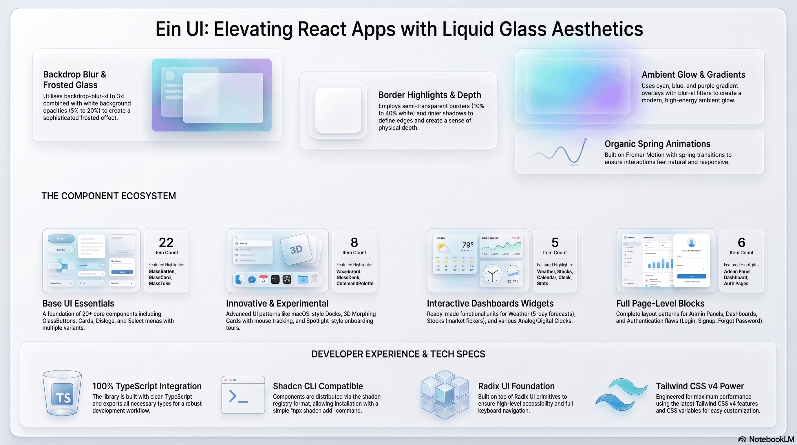

# Ein UI — Liquid Glass 组件库（整理版）

> 📦 本仓库整理自开源项目 [ehsanghaffar/einui](https://github.com/ehsanghaffar/einui)，原项目采用 ISC License，版权归原作者 Ehsan Ghaffar 所有。详见 [LICENCE](./LICENCE)。

Ein UI 是一套 React / Next.js 液态玻璃（Liquid Glass）风格 UI 组件库，兼容 shadcn/ui 的 registry 分发模式：没有传统 npm 包，组件通过 `shadcn add` 按需复制源码到你的项目。

## 技术栈

- React 19 + Next.js 16 + TypeScript
- Tailwind CSS v4
- shadcn/ui + Radix UI primitives
- framer-motion 动画、lucide-react 图标

## 组件分类

| 分类 | 内容 |
|------|------|
| 基础表单 | glass-button / input / select / textarea / checkbox / radio / switch / slider |
| 反馈展示 | glass-card / dialog / alert-dialog / badge / avatar / progress / skeleton / tooltip / popover / sheet |
| 导航布局 | glass-tabs / breadcrumb / separator / scroll-area / table |
| 创意组件 | command-palette / notification / dock / gauge / morph-card / ripple / spotlight / orb / waveform / timeline |
| 实用小组件 | calendar / clock / weather / stats / stock / map / area-chart |
| 页面模板 | 登录页 / 注册页 / 忘记密码页 / 定价页 / 后台管理面板 |

## 快速使用

```bash
# 在你的 shadcn 项目中按需安装单个组件
npx shadcn@latest add @einui/glass-card
npx shadcn@latest add @einui/glass-button
```

也支持从官方 registry 直接安装：`https://ui.eindev.ir/r/{组件名}.json`

## 本地预览

```bash
pnpm install
pnpm dev
```

---

以下为原项目文档（英文）：

---

# Ein UI — Liquid Glass Components (Shadcn Registry)

[](https://ui.eindev.ir)
[](/r/registry.json)
[](#key-features)
[](/LICENCE)
[](https://www.typescriptlang.org/)
[](https://nextjs.org/docs)
[](https://tailwindcss.com/)


<br/>

Welcome! Ein UI is a collection of beautiful, ready-made "liquid glass" components that you can preview, copy, and use in your website or app. This guide explains how to preview the components, get code snippets, and add a component to your project — no developer knowledge required.

✅ Great for: designers and frontend developers who want shareable, copy-and-paste UI components
with consistent design patterns and built-in accessibility.

---

## Key features

- Collection of handcrafted, accessible components built on top of Radix UI primitives and
  Tailwind CSS v4 (TypeScript + React 19).
- Components are distributed using the shadcn registry format — components are easy to install
  into other projects using the `shadcn` CLI.
- Built-in documentation site and component previews (Next.js 16 + app router)
- Example page templates / blocks (e.g., Admin Panel) to showcase layout patterns.
- Zod validation examples and server/client component patterns for modern full-stack apps.

---

## Quick links

- **Preview docs**: [Live preview](https://ui.eindev.ir)
- **Registry JSON**: [Registry JSON](/r/registry.json)
- **Try components**: For details, see `app/docs/components/*`

---

## Get started (local development)

Requirements: Node.js 20+ (recommended), pnpm (optional but used in this repo), or npm/yarn.

1. Clone the repo

```bash
git clone https://github.com/ehsanghaffar/ein-ui.git
cd ein-ui-shadcn-register
```

2 Install dependencies

```bash
# using pnpm
pnpm install

# or using npm
npm install

# or yarn
yarn install
```

3 Run development server

```bash
pnpm dev
# or npm run dev
# App runs on http://localhost:3000
```

### Using Next.js 16.1.0 bundle analyzer

To analyze your Next.js bundle, you can use the built-in experimental analyzer:

```bash
pnpm analyze
# or npm run analyze
```

## Contributing

Contributions welcome! Please read [`CONTRIBUTING.md`](./CONTRIBUTING.md) and follow the issue and PR templates when submitting work.

- Run `pnpm lint` to check code style
- New components should include comprehensive examples under `app/docs/components/*` and should declare any required `dependencies` in `registry.json`

Where to find guidance:

- Docs pages in the repo (`https://ui.eindev.ir/docs`) include live previews and code snippets.
- Use `shadcn` registry format to make your component discoverable via the CLI.

Please also see `CODE_OF_CONDUCT.md` and `SECURITY.md` for reporting guidelines.

---

## Support and help

- If the repository is hosted on GitHub, open an issue on the repo or create a Pull Request to propose changes
- For general usage of shadcn CLI ui.shadcn.com

---

## Maintainers

- Contributions are welcome — please open PRs and issues on the repo.

